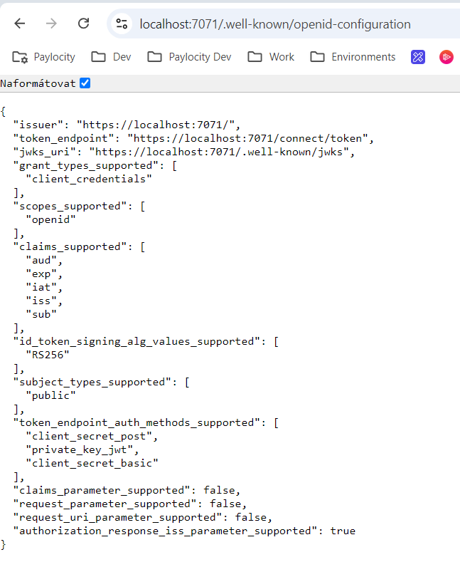
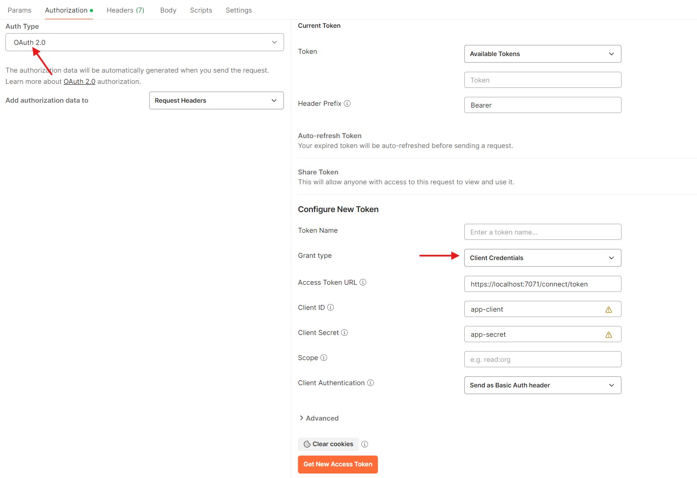
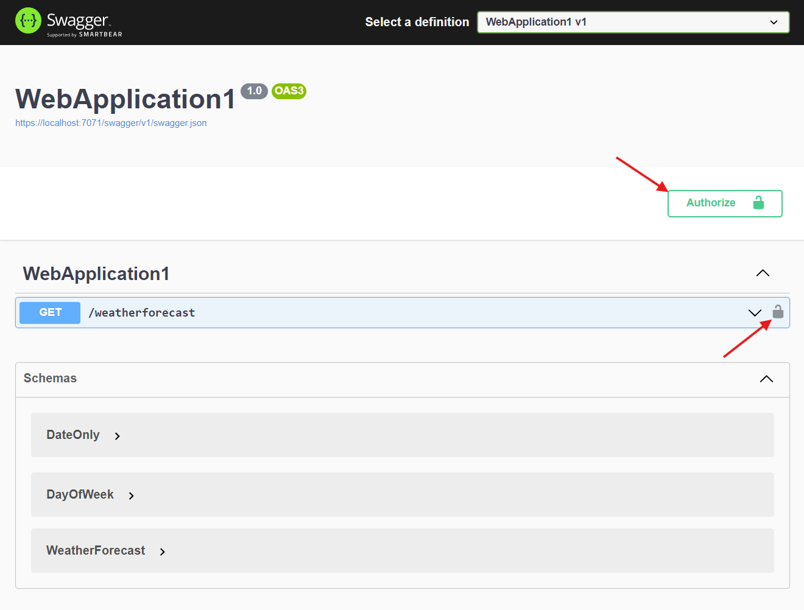
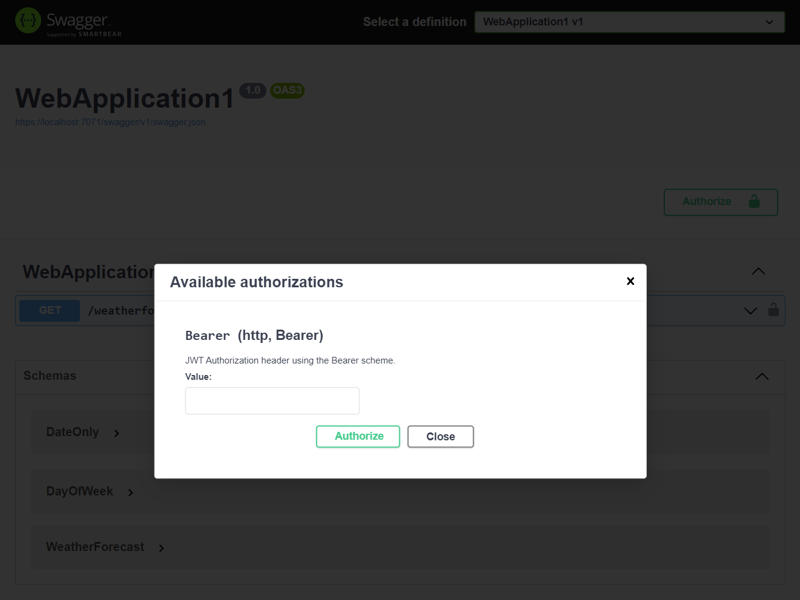
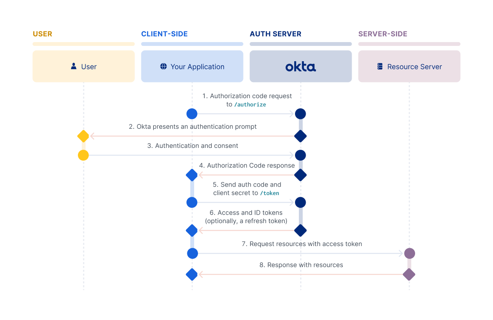
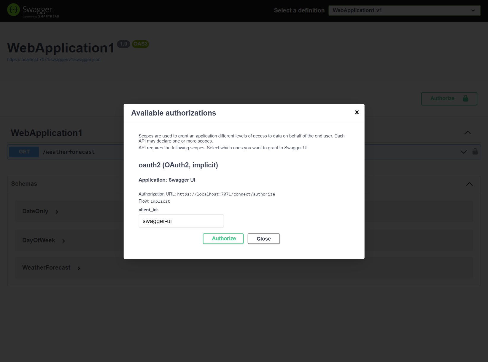

# OpenIddict

The `OpenIddict` is development stack implementing **OAuth2** and **OpenID Connect** protocols. The implementation is highly configurable and independent on any specific host or platform.
There is a downcost in a sense of that the stack does not use any of ideomatic approaches and it comes with its own specific approach.

The OpenIddict is higly configurable with modular design allowing to use only specific pieces from the stack. Each piece focuses on specific areas. 
- `Core` focuses on persistence configuration.
- `Client` configures the identity provider with external providers.
- `Server` configuration for your own identity provider.
- `Validation` is used for token validation in your API.

It is important to say that the `OpenIddict` focuses only on OAuth and OIDC and the authentication itself is left on us.

## User authentication in ASP.NET
The easies way, how to start with the `OpenIddict` is start from the beginning, the authentication itself that works exactly the same regardless of technology.
The authentication on web is fairly simple, it always requires a server cookie containing a user session identifier or any other identity identifier. The is common for any of languages and frameworks.

In the ASP.NET the first step is enable the authentication and set the authentication schemas.

```csharp
builder.Services
    .AddAuthentication(CookieAuthenticationDefaults.AuthenticationScheme)
    .AddCookie(CookieAuthenticationDefaults.AuthenticationScheme, options =>
    {
        options.LoginPath = "/login";
    });
```

Let's start with simple login form and ASP.NET minimal API.

```csharp
app.MapGet("/login", async context =>
    {
        var error = context.Request.Query["error"];
        var returning = context.Request.Query["returnUrl"];
        var url = StringValues.IsNullOrEmpty(returning) ? "/swagger" : returning.ToString();
        
        context.Response.ContentType = "text/html";
        await context.Response.WriteAsync(@$"
            <html>
            <body>
                <h1>Login</h1>
                {string.Join(" ", error)}
                <form method='post' action='/login'>
                    <input type='text' name='username' placeholder='Username' />
                    <input type='password' name='password' placeholder='Password' />
                    <input type='hidden' name='returnUrl' value='{url}' />
                    <button type='submit'>Login</button>
                </form>
            </body>
            </html>
        ");
    });
```

To handle POST callback we need the appropriate POST handler.

```csharp
app.MapPost("/login", async context =>
{
    var form = await context.Request.ReadFormAsync();
    var username = form["username"];
    var password = form["password"];
    var redirect = form["returnUrl"];

    // Validate user credentials (this is just a simple example)
    if (username == "john" && password == "password")
    {
        var claims = new List<Claim>
        {
            new Claim(ClaimTypes.Name, username!)
        };

        var identity = new ClaimsIdentity(claims, CookieAuthenticationDefaults.AuthenticationScheme);
        var principal = new ClaimsPrincipal(identity);

        // Beware we used SignIn with the default authentication schema
        await context.SignInAsync(principal);
        context.Response.Redirect(redirect.FirstOrDefault() ?? "/swagger");
    }
    else
    {
        context.Response.Redirect("/login?error=Invalid login attempt");
    }
});
```

At this point we have introduced the authentication. To requite authentication on an action or HTTP endpoint we have to apply the `RequireAuthorization()` builder along with enabling authorization.
```csharp
builder.Services.AddAuthorization();
```

## Adding OpenIddict auth
To add the `OpenIddict` we have to install a couple of nuget packages.

```
OpenIddict.AspNetCore
OpenIddict.EntityFrameworkCore
OpenIddict.Server.AspNetCore
Microsoft.EntityFrameworkCore
Microsoft.EntityFrameworkCore.InMemory
```

Next, we have to configura the `OpenIddict` stack.

```csharp
// Register in-memory DbContext
builder.Services.AddDbContext<DbContext>(options =>
{
    options
        .UseInMemoryDatabase(nameof(DbContext))
        .UseOpenIddict();
});

builder.Services
    .AddOpenIddict()
    .AddCore(options =>
    {
        // Configure OpenIddict to use in-memory storage
        options
            .UseEntityFrameworkCore()
            .UseDbContext<DbContext>();
    })
    .AddServer(options =>
    {
        // Register the signing and encryption credentials - in production replace with passphrase or better with certificates
        options
            .AddDevelopmentEncryptionCertificate()
            .AddDevelopmentSigningCertificate();

        // Register the ASP.NET Core host and configure the ASP.NET Core-specific options
        options
            .UseAspNetCore();
    })
    .AddValidation(options =>
    {
        // Import the configuration from the local OpenIddict server instance
        options.UseLocalServer();

        // Register the ASP.NET Core host
        options.UseAspNetCore();
    });
```

At this point, if you would try to run the app and access to any endpoint the app would return an error about missing any OAuth2/OIDC configuration. Let's start with the most the `client_credentials` grant type.

### Client Credentials
This grant type **must** be used only in secure environments and only by trusted clients.

```csharp
builder.Services
    .AddOpenIddict()
    .AddServer(options =>
    {
        // Enable the token endpoint
        options.SetTokenEndpointUris("/connect/token");

        // Enable the client credentials flow
        options.AllowClientCredentialsFlow();

        // ...

        // Register the ASP.NET Core host and configure the ASP.NET Core-specific options.
        options
            .UseAspNetCore()
            // Runs OpenIddict validations for Token Endpoint validation and pass the request down in middlewares
            .EnableTokenEndpointPassthrough();
    });
```

Next, we have to do a couple of things, beginning with creating the client.

```csharp
public class CreateClients(IServiceProvider serviceProvider) : IHostedService
{
    public async Task StartAsync(CancellationToken cancellationToken)
    {
        using var scope = serviceProvider.CreateScope();

        var manager = scope.ServiceProvider.GetRequiredService<IOpenIddictApplicationManager>();
        await SeedAppClientAsync(manager, cancellationToken);
    }

    public Task StopAsync(CancellationToken cancellationToken) => Task.CompletedTask;

    private static async Task SeedAppClientAsync(IOpenIddictApplicationManager manager, CancellationToken cancellationToken)
    {
        const string ID = "app-client";

        await manager.CreateAsync(new OpenIddictApplicationDescriptor
        {
            ClientId = ID,
            ClientSecret = "app-secret",
            DisplayName = "Application Client",
            Permissions =
            {
                OpenIddictConstants.Permissions.Endpoints.Token,
                OpenIddictConstants.Permissions.GrantTypes.ClientCredentials,
            }
        }, cancellationToken);
    }
}
```

Don't forget register the seed in the application startup.

```csharp
builder.Services.AddHostedService<CreateClients>();
```

Now, let's verify the OIDC configuration https://localhost:7071/.well-known/openid-configuration.



From this point we have correct OAuth2 configuration for the `client_credentials` grant type, however, the `OpenIddict` requires from you to implement tha actual token endpoint.

```csharp
app.MapPost("/connect/token", (HttpContext context) =>
{
    var request = context.GetOpenIddictServerRequest()!;
    if (request.IsClientCredentialsGrantType())
    {
        // Create the identity in custom schema
        var identity = new ClaimsIdentity(OpenIddictServerAspNetCoreDefaults.AuthenticationScheme);

        // Use the client_id as the subject identifier.
        identity.SetClaim(OpenIddictConstants.Claims.Subject, request.ClientId);
        
        // Add a custom claim
        identity.AddClaim("foo", "bar");
        
        // Set the claims destination
        identity.SetDestinations(_ => [OpenIddictConstants.Destinations.AccessToken]);

        var principal = new ClaimsPrincipal(identity);
        principal.SetScopes(request.GetScopes());

        return Results.SignIn(principal, authenticationScheme: OpenIddictServerAspNetCoreDefaults.AuthenticationScheme);
    }

    return Results.Unauthorized();
});
```

Now, we are able actually get the token using the Postman.


### Enable Bearer token in Swagger
In SwaggerUI you can enable authentication directly from the UI, however, it requires a bit of configuration.

```csharp
builder.Services.AddSwaggerGen(options =>
{
    options.AddSecurityRequirement(new OpenApiSecurityRequirement
    {
        {
            new OpenApiSecurityScheme
            {
                Reference = new OpenApiReference
                {
                    // The identifier is case sensitive and must match
                    Id = "Bearer",
                    Type = ReferenceType.SecurityScheme
                }
            },
            new List<string>(0)
        }
    });
    
    // Configuration for the modal window
    options.AddSecurityDefinition("Bearer", new OpenApiSecurityScheme
    {
        Description = "JWT Authorization header using the Bearer scheme.",
        Type = SecuritySchemeType.Http,
        Scheme = "bearer",
    });
});
```

After that you can use the bearer authentication directly from the SwaggerUI.





### The API authorization cookies problem
You may noticed that if you try to call the API endpoint without a bearer token you still get the data instead of being challange to sign in.
The reason why it's happening is because at the beginning we set the default authentication schema to be cookies, but that's not the best option for the HTTP API endpoints.
To fix it you have to update the authentication setup.

```csharp
builder.Services
    .AddAuthentication(options =>
    {
        // The default scheme changes to the OpenIddict
        options.DefaultScheme = OpenIddictValidationAspNetCoreDefaults.AuthenticationScheme;
        // But for the SignIn we still want to use the Cookie-based flow
        options.DefaultSignInScheme = CookieAuthenticationDefaults.AuthenticationScheme;
    })
    .AddCookie(CookieAuthenticationDefaults.AuthenticationScheme, options =>
    {
        options.LoginPath = "/login"; // Redirect to this path for login
    });
```

### Authorization Code flow
The client credentials grant type is just a beginning and the most common reason why you would build an Identity provider would be the `authorization_code` grant type. As you may already expected, it all starts with the OpenIddict configuration.

```csharp
builder.Services
    .AddOpenIddict()
    .AddServer(options =>
    {
        // Enable the authorization endpoint.
        options.SetAuthorizationEndpointUris("/connect/authorize");
        
        // Enable the authorization code flow.
        options
            .AllowAuthorizationCodeFlow()
            .RequireProofKeyForCodeExchange();
        
        // Enable refresh tokens
        options.AllowRefreshTokenFlow();
        
        // Register the ASP.NET Core host and configure the ASP.NET Core-specific options.
        options
            .UseAspNetCore()
            // Runs OpenIddict validations for Token Endpoint validation and pass the request down in middlewares
            .EnableAuthorizationEndpointPassthrough();
    });
```

The authorization flow is different to the client credentials flow and it involves multiple hops we also need new endpoint. The flow itself is captured in the diagram bellow. The image is taken from [Okta docs](https://developer.okta.com/docs/guides/implement-grant-type/authcode/main/), so instead of Okta imagine our Identity provider.



```csharp
app.MapGet("/connect/authorize", async (HttpContext context) =>
    {
        var request = context.GetOpenIddictServerRequest();
        var result = await context.AuthenticateAsync(CookieAuthenticationDefaults.AuthenticationScheme);

        if (!result.Succeeded)
        {
            // Redirect the user to the login page and preserve the original return URL
            // Import is to request the Cookies authentication scheme
            return Results.Challenge(new AuthenticationProperties
            {
                RedirectUri = context.Request.Path + context.Request.QueryString
            }, [CookieAuthenticationDefaults.AuthenticationScheme]);
        }

        var claims = new List<Claim>
        {
            new Claim(OpenIddictConstants.Claims.Subject, result.Principal.Identity.Name!),
            new Claim(OpenIddictConstants.Claims.Name, result.Principal.Identity.Name!),
            new Claim("email", "john@myapp.local").SetDestinations(OpenIddictConstants.Destinations.IdentityToken),
        };

        var identity = new ClaimsIdentity(claims, OpenIddictServerAspNetCoreDefaults.AuthenticationScheme);
        var principal = new ClaimsPrincipal(identity);

        principal.SetScopes(request.GetScopes());
        principal.SetResources("resource_server");

        return Results.SignIn(principal, authenticationScheme: OpenIddictServerAspNetCoreDefaults.AuthenticationScheme);
    })
    .ExcludeFromDescription();
```

We create also a new client just for authorization code flow, however, you may combine multiple flow together under one client, but always think about possible revocation and how effect it would have on your users.
In our case we use public client, that's the client for public use, typically a SPA application and does not require a secret, but the PKCE is in some implementations required on server, client, or both sides.

```csharp
private static async Task SeedAuthClientAsync(IOpenIddictApplicationManager manager, CancellationToken cancellationToken)
{
    const string ID = "auth-client";

    await manager.CreateAsync(new OpenIddictApplicationDescriptor
    {
        ClientId = ID,
        // With PKCE the secret is not required
        // ClientSecret = "auth-secret",
        ClientType = OpenIddictConstants.ClientTypes.Public,
        DisplayName = "Auth Client",
        RedirectUris = { new Uri("https://oauth.pstmn.io/v1/callback") },
        Permissions =
        {
            OpenIddictConstants.Permissions.Endpoints.Authorization,
            OpenIddictConstants.Permissions.Endpoints.Token,
            
            OpenIddictConstants.Permissions.GrantTypes.AuthorizationCode,
            OpenIddictConstants.Permissions.GrantTypes.RefreshToken,
            
            // Don't forget to enable them in server configuration
            // options.RegisterScopes(OpenIddictConstants.Scopes.Profile, OpenIddictConstants.Scopes.Email);
            OpenIddictConstants.Permissions.Scopes.Email,
            OpenIddictConstants.Permissions.Scopes.Profile,
            
            OpenIddictConstants.Permissions.ResponseTypes.Code,
        }
    }, cancellationToken);
}
```

We also muse extend existing `token` endpoint to able assign access token.

```csharp
if (request.IsAuthorizationCodeGrantType())
{
    // Retrieve the claims principal stored in the authorization code
    var auth = await context.AuthenticateAsync(OpenIddictServerAspNetCoreDefaults.AuthenticationScheme);
    return TypedResults.SignIn(auth.Principal, authenticationScheme: OpenIddictServerAspNetCoreDefaults.AuthenticationScheme);
}
```

To get the `IdToken` token in response you must specify the `openid` scope.

## Swagger authentication
We can improve the DX in swagger to make the whole authorization flow inside the SwaggerUI. However, such change requires an `implicit` grant type client that should not be used for new application, because its broken beyond repair and all the new apps should use oly the authorization code with PCKE (Proof of Key Code Exchange).

```csharp
private static async Task SeedSwaggerClientAsync(IOpenIddictApplicationManager manager, CancellationToken cancellationToken)
{
    const string ID = "swagger-ui";

    await manager.CreateAsync(new OpenIddictApplicationDescriptor
    {
        RedirectUris =
        {
            new Uri("https://localhost:7071/swagger/oauth2-redirect.html"),
        },
        ClientId = ID,
        DisplayName = "Swagger UI Client",
        ClientType = OpenIddictConstants.ClientTypes.Public,
        ConsentType = OpenIddictConstants.ConsentTypes.Implicit,
        Permissions =
        {
            OpenIddictConstants.Permissions.Endpoints.Authorization,
            OpenIddictConstants.Permissions.Endpoints.Token,
            OpenIddictConstants.Permissions.GrantTypes.Implicit,
            OpenIddictConstants.Permissions.GrantTypes.AuthorizationCode,
            OpenIddictConstants.Permissions.Scopes.Email,
            OpenIddictConstants.Permissions.Scopes.Profile,
            OpenIddictConstants.Permissions.ResponseTypes.Token,
            OpenIddictConstants.Permissions.ResponseTypes.CodeToken,
        }
    }, cancellationToken);
}
```

We must also modify the Swagger get configuration.

```csharp
builder.Services.AddSwaggerGen(options =>
{
    options.AddSecurityRequirement(new OpenApiSecurityRequirement
    {
        {
            new OpenApiSecurityScheme
            {
                Reference = new OpenApiReference
                {
                    Type = ReferenceType.SecurityScheme,
                    Id = "oauth2"
                },
                Scheme = "oauth2",
                Name = "oauth2",
                In = ParameterLocation.Header
            },
            new List<string>(0)
        }
    });
    
    options.AddSecurityDefinition("oauth2", new OpenApiSecurityScheme
    {
        Type = SecuritySchemeType.OAuth2,
        Flows = new OpenApiOAuthFlows
        {
            Implicit = new OpenApiOAuthFlow
            {
                AuthorizationUrl = new Uri("https://localhost:7071/connect/authorize"),
                TokenUrl = new Uri("https://localhost:7071/connect/token"),
                Scopes = new Dictionary<string, string>()
            }
        }
    });
});
```

We need provide the client configuration into the Swagger UI.

```csharp
app.UseSwagger();
    app.UseSwaggerUI(options =>
    {
        options.OAuthAppName("Swagger UI");
        options.OAuthClientId("swagger-ui");
        options.OAuthClientSecret("");
        options.OAuthUseBasicAuthenticationWithAccessCodeGrant();
    });
```

And don't forget to enable implicit flow in the OpenIddict.

```csharp
builder.Services
    .AddOpenIddict()
    .AddServer(options =>
    {
        // Enable the implicit grant flow.
        options.AllowImplicitFlow();
    });
```

The final and desired DX.



## Refresh token

To get the refresh token in response you must request the `offline_access` scope and extend the `token` endpoint.

```csharp
if (request.IsRefreshTokenGrantType())
{
    // Retrieve the claims principal stored in the authorization code
    var auth = await context.AuthenticateAsync(OpenIddictServerAspNetCoreDefaults.AuthenticationScheme);
    return TypedResults.SignIn(auth.Principal, authenticationScheme: OpenIddictServerAspNetCoreDefaults.AuthenticationScheme);
}
```

## Final thoughts

Authentication, Authorization, and User identity, or overall user security are extremely hard. Before you even start thinking about an Identity provider, analyze if you really need an Identity provider, wouldn't there be more lightway solutions which would be a better fix to your problem? Maybe the Cookies-based authentication is sufficient, or maybe the ASP.NET Identity with bearer tokens would suit your needs better.
User security is not only login page but also resetting password flow, blocking users, deleting users, getting GDPR-related data out of your system and many more cases that you **must** nowadays fulfil.
If you still decide to go with an identity provider, before you start building on your Identity provider, consider the **costs of building and maintaining your solution** versus **using existing services** like Auth0, Okna, Microsoft EntryID or Keycloak. 

That's it, keep codes going and see you later.

---

September, 2024 <br />
[Sebastian](mailto:ja@sebastianbusek.cz) <br />